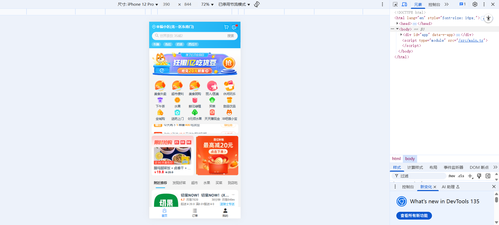
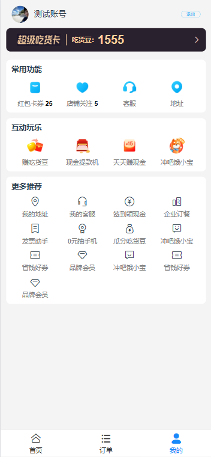

# ele-h5

旨在使用Vue3高仿外卖Web App。项目涵盖功能页面、轮播图、滚动加载、图片懒加载、购物车、滚动组件、动画效果、Token登录等内容。




## 1.1、应用的技术栈

### **后端技术栈（ele-h5-server）**

1. **核心框架**
   - **Node.js**：基于JavaScript运行时环境搭建服务端。
   - **JSON Server**：用于快速搭建RESTful API Mock服务器，通过零代码实现CRUD接口。
2. **安全认证**
   - **jsonwebtoken (JWT)**：用于实现基于Token的用户认证机制。
3. **开发工具**
   - **Nodemon**：开发时监听文件变化自动重启服务，提升调试效率。
4. **入口文件**
   - `src/app.js`：服务主入口，可能包含路由定义和中间件配置。

---

### **前端技术栈（ele-h5）**

1. **核心框架**
   - **Vue 3**：使用组合式API（Composition API）构建响应式单页应用。
   - **TypeScript**：提供静态类型检查，增强代码健壮性。
2. **构建工具**
   - **Vite**：下一代前端构建工具，支持极速的冷启动和HMR热更新。
   - **Vue-TSC**：用于Vue单文件组件的TypeScript类型检查。
3. **状态管理**
   - **Pinia**：轻量级且类型友好的状态管理库，替代Vuex。
4. **UI组件库**
   - **Vant 4**：面向移动端的Vue组件库，提供丰富的预制组件。
5. **路由管理**
   - **Vue Router 4**：实现前端路由控制，支持动态路由和导航守卫。
6. **HTTP客户端**
   - **Axios**：处理HTTP请求，支持拦截器封装和异步数据获取。
7. **样式处理**
   - **Sass**：CSS预处理器，增强样式编写能力。
   - **PostCSS**：通过`autoprefixer`自动添加浏览器前缀，`postcss-pxtorem`实现px到rem的转换。
   - **Normalize.css & Reset.css**：统一不同浏览器的默认样式。
8. **代码规范**
   - **ESLint**：代码质量检查，配合Vue/TypeScript规则。
   - **Prettier**：自动格式化代码，保持风格统一。
   - **Husky + lint-staged**：Git提交时触发代码检查和格式化。

## 1.2、应用的架构


## 1.3、快速开始

```sh
npm install
```

进入ele-h5目录

```sh
cd ele-h5
npm run dev
```


后端启动进入

```bash
cd ele-h5-server
npm run server
```


## 1.4、主要特点

#### 1. **技术栈先进且完整**

- **前端框架**：基于 Vue3 生态，使用 Composition API 提升逻辑复用性。
- **状态管理**：采用 Pinia 实现模块化状态管理，包含 State、Getter、Action 等核心功能。
- **构建工具**：使用 Vite 搭建项目，集成 ESLint、Prettier、Commitlint 规范代码与提交流程，支持请求代理和组件自动按需引入。
- **类型支持**：整合 TypeScript，覆盖函数、接口、类、泛型等核心概念，提升代码健壮性。
- **路由管理**：Vue-Router4 实现动态路由匹配，支持复杂页面跳转逻辑。

#### 2. **模块化与组件化设计**

- **接口模块**：7 个核心接口（如用户登录、商品列表），实现前后端解耦。
- **视图组件**：6 个主视图（如首页、商家详情），逻辑与 UI 分离。
- **基础组件**：封装 ScrollView、Loading 等通用组件，提升复用性。
- **业务组件**：10+ 场景化组件（如购物车、倒计时），覆盖核心业务需求。

#### 3. **性能优化深度实践**

- **请求优化**：通过 `useDebounce` 防抖减少无效请求。
- **渲染优化**：结合 `KeepAlive` 缓存页面、图片懒加载（LazyLoad）、按需渲染（`useLazyRender`）降低资源消耗。
- **逻辑优化**：利用 `useAsync`、`useLocalStorage` 等 Composition API 封装异步与本地存储逻辑。

#### 4. **设计模式落地应用**

- **发布订阅模式**：实现 `EventEmitter` 类，支持事件通信。
- **组合模式**：通过 `Actions` 类整合多步骤操作。
- **责任链模式**：处理事件冒泡逻辑，提升代码扩展性。
- **工厂模式**：构建滚动动画类 `Animater`，统一动画管理。
- **代理模式**：封装 `MScroll` 类，优化滚动行为。

#### 5. **工程化与规范管理**

- **Git 流程**：配置 SourceTree 工具，规范分支管理与代码提交。
- **跨域与代理**：通过 Vite 设置请求代理，解决开发环境跨域问题。
- **持续集成部署**：集成 DevOps 实践，覆盖版本管理、自动化测试与部署流程。

#### 6. **业务场景全覆盖**

- 支持用户端功能（登录、商品浏览、购物车），商家端管理（商家列表、详情），以及搜索、金刚位等运营需求，完整覆盖电商类业务场景。

## 1.5、页面展示

主页：


懒加载：


用户页



商品详情页：


购物车功能：


商品详情：


